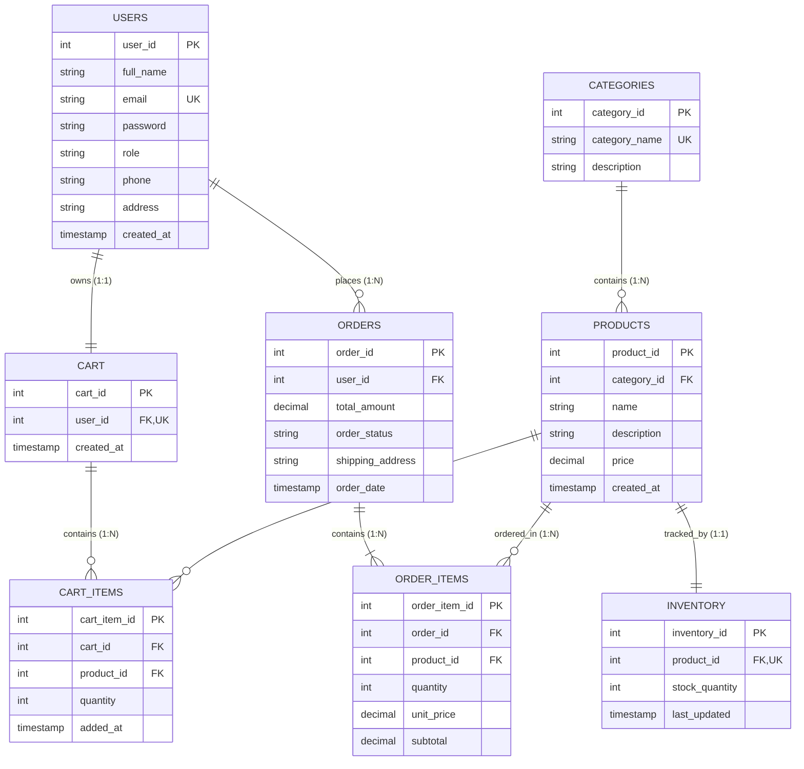
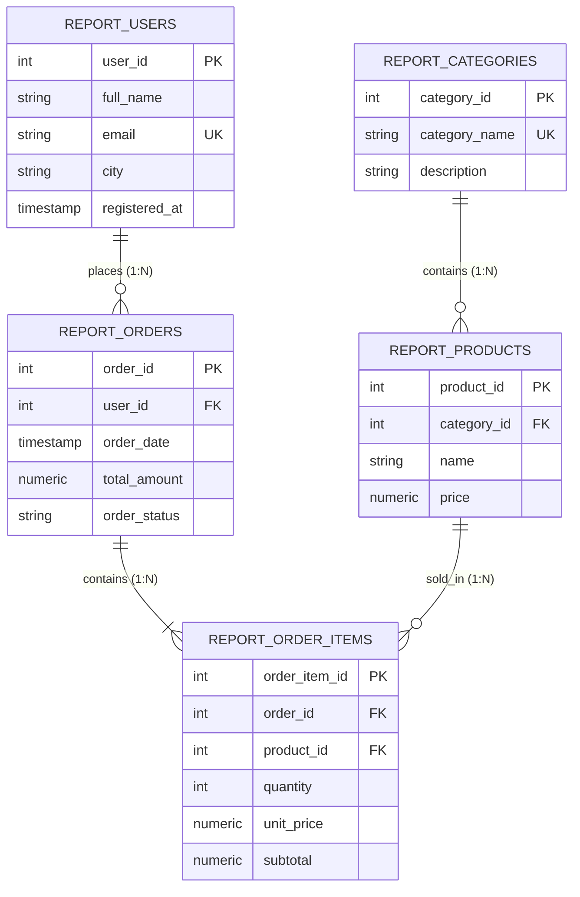

# Entity-Relationship (ER) Diagram

---

## 1. Primary MySQL Database Schema (`vyaapaar_db`)

```mermaid
erDiagram
    USERS ||--|| CART : "owns (1:1)"
    USERS ||--o{ ORDERS : "places (1:N)"
    CATEGORIES ||--o{ PRODUCTS : "contains (1:N)"
    PRODUCTS ||--|| INVENTORY : "tracked_by (1:1)"
    CART ||--o{ CART_ITEMS : "contains (1:N)"
    PRODUCTS ||--o{ CART_ITEMS : "added_as (1:N)"
    ORDERS ||--|{ ORDER_ITEMS : "contains (1:N)"
    PRODUCTS ||--o{ ORDER_ITEMS : "ordered_in (1:N)"

    USERS {
        int user_id PK
        string full_name
        string email UK
        string password
        string role
        string phone
        string address
        timestamp created_at
    }

    CATEGORIES {
        int category_id PK
        string category_name UK
        string description
    }

    PRODUCTS {
        int product_id PK
        int category_id FK
        string name
        string description
        decimal price
        timestamp created_at
    }

    INVENTORY {
        int inventory_id PK
        int product_id FK,UK
        int stock_quantity
        timestamp last_updated
    }

    CART {
        int cart_id PK
        int user_id FK,UK
        timestamp created_at
    }

    CART_ITEMS {
        int cart_item_id PK
        int cart_id FK
        int product_id FK
        int quantity
        timestamp added_at
    }

    ORDERS {
        int order_id PK
        int user_id FK
        decimal total_amount
        string order_status
        string shipping_address
        timestamp order_date
    }

    ORDER_ITEMS {
        int order_item_id PK
        int order_id FK
        int product_id FK
        int quantity
        decimal unit_price
        decimal subtotal
    }
```

---

## 2. PostgreSQL Reporting Database Schema (`vyaapaar_reporting`)

```mermaid
erDiagram
    REPORT_CATEGORIES ||--o{ REPORT_PRODUCTS : "contains (1:N)"
    REPORT_USERS ||--o{ REPORT_ORDERS : "places (1:N)"
    REPORT_ORDERS ||--|{ REPORT_ORDER_ITEMS : "contains (1:N)"
    REPORT_PRODUCTS ||--o{ REPORT_ORDER_ITEMS : "sold_in (1:N)"

    REPORT_USERS {
        int user_id PK
        string full_name
        string email UK
        string city
        timestamp registered_at
    }

    REPORT_CATEGORIES {
        int category_id PK
        string category_name UK
        string description
    }

    REPORT_PRODUCTS {
        int product_id PK
        int category_id FK
        string name
        numeric price
    }

    REPORT_ORDERS {
        int order_id PK
        int user_id FK
        timestamp order_date
        numeric total_amount
        string order_status
    }

    REPORT_ORDER_ITEMS {
        int order_item_id PK
        int order_id FK
        int product_id FK
        int quantity
        numeric unit_price
        numeric subtotal
    }
```
