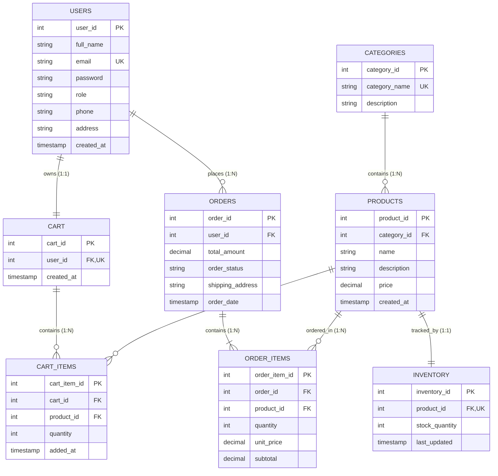

# VYAAPAAR
## E-Commerce Order & Inventory Management System

---

### A Project Report
Submitted in partial fulfillment of the requirements for the degree of  
**Bachelor of Engineering (B.E.)**  
in  
**Artificial Intelligence & Data Science**

---

**Submitted by:**  
* **Student Name:** `[Insert Student Full Name]`  
* **Roll Number:** `[Insert Roll Number / PRN]`  
* **Division / Class:** `[Insert Class / Division]`  

**Under the Guidance of:**  
* **Project Guide:** `[Insert Project Guide Name & Designation]`  

**Department of Artificial Intelligence & Data Science**  
**`[Insert College Name & Location]`**  
**Academic Year:** `[Insert Academic Year, e.g., 2025–2026]`  

\newpage

---

## 2. CERTIFICATE

This is to certify that the project entitled:

> **"VYAAPAAR — E-COMMERCE ORDER & INVENTORY MANAGEMENT SYSTEM"**

submitted by:

| Student Name | Roll Number |
| :--- | :--- |
| `[Insert Student Full Name]` | `[Insert Roll Number]` |

is a bonafide record of the project work carried out by them in partial fulfillment of the requirements for the award of the degree of **Bachelor of Engineering in Artificial Intelligence & Data Science** from **`[Insert College / University Name]`** during the academic year **`[Insert Academic Year]`**.

The project has been approved as satisfying the academic requirements prescribed for the project work.

<br><br><br>

_________________________ &nbsp;&nbsp;&nbsp;&nbsp;&nbsp;&nbsp;&nbsp;&nbsp;&nbsp;&nbsp;&nbsp;&nbsp;&nbsp;&nbsp;&nbsp;&nbsp;&nbsp;&nbsp;&nbsp;&nbsp;&nbsp;&nbsp;&nbsp;&nbsp; _________________________  
**`[Guide Name]`** &nbsp;&nbsp;&nbsp;&nbsp;&nbsp;&nbsp;&nbsp;&nbsp;&nbsp;&nbsp;&nbsp;&nbsp;&nbsp;&nbsp;&nbsp;&nbsp;&nbsp;&nbsp;&nbsp;&nbsp;&nbsp;&nbsp;&nbsp;&nbsp;&nbsp;&nbsp;&nbsp;&nbsp;&nbsp;&nbsp;&nbsp;&nbsp;&nbsp;&nbsp;&nbsp;&nbsp;&nbsp;&nbsp;&nbsp;&nbsp;&nbsp;&nbsp;&nbsp;&nbsp;&nbsp;&nbsp;&nbsp;&nbsp;&nbsp;&nbsp;&nbsp;&nbsp; **`[HOD Name]`**  
Project Guide &nbsp;&nbsp;&nbsp;&nbsp;&nbsp;&nbsp;&nbsp;&nbsp;&nbsp;&nbsp;&nbsp;&nbsp;&nbsp;&nbsp;&nbsp;&nbsp;&nbsp;&nbsp;&nbsp;&nbsp;&nbsp;&nbsp;&nbsp;&nbsp;&nbsp;&nbsp;&nbsp;&nbsp;&nbsp;&nbsp;&nbsp;&nbsp;&nbsp;&nbsp;&nbsp;&nbsp;&nbsp;&nbsp;&nbsp;&nbsp;&nbsp;&nbsp;&nbsp;&nbsp;&nbsp;&nbsp;&nbsp;&nbsp;&nbsp;&nbsp;&nbsp;&nbsp;&nbsp;&nbsp;&nbsp;&nbsp; Head of Department  
Department of AI & DS &nbsp;&nbsp;&nbsp;&nbsp;&nbsp;&nbsp;&nbsp;&nbsp;&nbsp;&nbsp;&nbsp;&nbsp;&nbsp;&nbsp;&nbsp;&nbsp;&nbsp;&nbsp;&nbsp;&nbsp;&nbsp;&nbsp;&nbsp;&nbsp;&nbsp;&nbsp;&nbsp;&nbsp;&nbsp;&nbsp;&nbsp;&nbsp;&nbsp;&nbsp;&nbsp;&nbsp;&nbsp;&nbsp;&nbsp; Department of AI & DS  

<br><br>

_________________________ &nbsp;&nbsp;&nbsp;&nbsp;&nbsp;&nbsp;&nbsp;&nbsp;&nbsp;&nbsp;&nbsp;&nbsp;&nbsp;&nbsp;&nbsp;&nbsp;&nbsp;&nbsp;&nbsp;&nbsp;&nbsp;&nbsp;&nbsp;&nbsp; _________________________  
**Internal Examiner** &nbsp;&nbsp;&nbsp;&nbsp;&nbsp;&nbsp;&nbsp;&nbsp;&nbsp;&nbsp;&nbsp;&nbsp;&nbsp;&nbsp;&nbsp;&nbsp;&nbsp;&nbsp;&nbsp;&nbsp;&nbsp;&nbsp;&nbsp;&nbsp;&nbsp;&nbsp;&nbsp;&nbsp;&nbsp;&nbsp;&nbsp;&nbsp;&nbsp;&nbsp;&nbsp;&nbsp;&nbsp;&nbsp;&nbsp;&nbsp;&nbsp;&nbsp;&nbsp;&nbsp;&nbsp; **External Examiner**  

<br><br>

_________________________  
**`[Principal Name]`**  
Principal, `[Insert College Name]`  

\newpage

---

## 3. DECLARATION

I hereby declare that the project work entitled **"VYAAPAAR — E-Commerce Order & Inventory Management System"** is an authentic record of our own work carried out under the supervision and guidance of **`[Insert Guide Name]`**, Department of Artificial Intelligence & Data Science, **`[Insert College Name]`**.

This work has not been submitted elsewhere for the award of any other degree, diploma, fellowship, or similar title to any other University or Institution.

<br><br>

**Date:** `[Insert Submission Date]`  
**Place:** `[Insert College City / Location]`  

<br><br>

_________________________  
**`[Insert Student Full Name]`**  
Roll Number: `[Insert Roll Number]`  

\newpage

---

## 4. ACKNOWLEDGEMENT

I take this opportunity to express my profound gratitude and deep regards to my project guide, **`[Insert Guide Name]`**, for their exemplary guidance, constant encouragement, and constructive feedback throughout the design, development, and documentation of this project.

I am deeply thankful to **`[Insert HOD Name]`**, Head of the Department of Artificial Intelligence & Data Science, for providing the necessary institutional facilities, computing infrastructure, and supportive academic environment.

I would also like to express my sincere appreciation to our Principal, **`[Insert Principal Name]`**, for their overall leadership and encouragement across all academic endeavors.

Special thanks are extended to all faculty members, laboratory assistants, and technical staff of the Department of AI & DS for their timely help and valuable suggestions. Lastly, I extend my heartfelt gratitude to my family and friends for their constant support and understanding throughout the course of this project.

<br><br>

**`[Insert Student Name]`**  

\newpage

---

## 5. ABSTRACT

**Vyaapaar (व्यापार)** is an enterprise-modeled, console-based E-Commerce Order and Inventory Management System developed using **Core Java (Java SE 17)**, **Java Database Connectivity (JDBC)**, **MySQL**, and **PostgreSQL**. The software was engineered to provide an automated, relational, and robust digital alternative to error-prone manual retail tracking and disconnected spreadsheets.

The system is structured upon the **3-Tier Layered Architecture Pattern** (Presentation Layer $\rightarrow$ Service Layer $\rightarrow$ Data Access Layer $\rightarrow$ Relational Database). It delivers isolated, role-based workflows for **Customers** and **Administrators**:
* **Customer Workflow**: User registration with duplicate email prevention, credential authentication, categorized product catalog browsing, dynamic keyword search, persistent shopping cart management, transactional checkout, and historical order tracking.
* **Administrator Workflow**: Product category organization, catalog product creation and modification, real-time inventory monitoring with negative-stock prevention, customer order fulfillment tracking (`PENDING`, `CONFIRMED`, `SHIPPED`, `DELIVERED`, `CANCELLED`), and access to analytical reporting.
* **Inventory & Order Management**: Real-time stock verification prevents overselling. Multi-table checkout operations are governed by programmatic JDBC transaction boundaries (`setAutoCommit(false)`, `commit()`, and `rollback()`), guaranteeing that order creation, immutable item snapshot recording, inventory deduction, and cart clearing either succeed atomically or roll back completely on failure.
* **PostgreSQL Advanced SQL Reporting**: A separate, decoupled reporting database demonstrates complex analytical querying techniques including multi-table `INNER/LEFT JOIN`s, `GROUP BY`, `HAVING`, aggregate calculations (`SUM`, `AVG`, `COUNT`), scalar subqueries, `NOT IN` subqueries, `CASE` conditional expressions, and date grouping.

By avoiding high-level ORM frameworks and web abstractions, **Vyaapaar** provides complete clarity into JDBC connection lifecycles, `PreparedStatement` parameter bindings, and database relational constraints, fulfilling all academic criteria for software engineering and database management coursework.

\newpage

---

## 6. TABLE OF CONTENTS

| Section | Title |
| :--- | :--- |
| **1** | **Title Page** |
| **2** | **Certificate** |
| **3** | **Declaration** |
| **4** | **Acknowledgement** |
| **5** | **Abstract** |
| **6** | **Table of Contents** |
| **7** | **Introduction** |
| | 7.1 Growth of E-Commerce Systems |
| | 7.2 Importance of Digital Order Management |
| | 7.3 Inventory Tracking & Consistency |
| | 7.4 Customer and Order Lifecycle |
| | 7.5 Need for Database-Driven Systems |
| | 7.6 Introduction to Vyaapaar |
| **8** | **Problem Statement** |
| | 8.1 Limitations of Manual Record-Keeping |
| | 8.2 The Vyaapaar Solution |
| **9** | **Objectives** |
| **10** | **Scope** |
| | 10.1 Customer Scope |
| | 10.2 Administrator Scope |
| | 10.3 Out of Scope Boundaries |
| **11** | **Technology Stack** |
| **12** | **System Requirements** |
| | 12.1 Hardware Requirements |
| | 12.2 Software Requirements |
| **13** | **System Architecture** |
| | 13.1 3-Tier Layered Architecture |
| | 13.2 Layer Responsibilities & Decoupling |
| | 13.3 PostgreSQL Reporting Flow |
| **14** | **Modules** |
| | 14.1 Authentication Module |
| | 14.2 Customer Module |
| | 14.3 Product Module |
| | 14.4 Category Module |
| | 14.5 Inventory Module |
| | 14.6 Cart Module |
| | 14.7 Order Module |
| | 14.8 Administrator Module |
| | 14.9 Reporting Module |
| **15** | **Database Design** |
| | 15.1 Primary MySQL Database Schema |
| | 15.2 Analytical PostgreSQL Database Schema |
| **16** | **Entity-Relationship (ER) Diagram** |
| **17** | **Database Normalization** |
| | 17.1 First Normal Form (1NF) |
| | 17.2 Second Normal Form (2NF) |
| | 17.3 Third Normal Form (3NF) |
| **18** | **JDBC Implementation** |
| | 18.1 JDBC Component Lifecycle |
| | 18.2 Parameterized PreparedStatements & SQL Injection Immunity |
| | 18.3 Resource Management via Try-With-Resources |
| **19** | **Transaction Management** |
| | 19.1 ACID Properties in Checkout |
| | 19.2 Step-by-Step Checkout Transaction Flow |
| | 19.3 Rollback Handling & Consistency Guarantee |
| **20** | **SQL Implementation** |
| | 20.1 Core DDL & Integrity Constraints |
| | 20.2 Complex Analytical Queries & Concrete Examples |
| **21** | **User Workflows** |
| | 21.1 Customer Workflow |
| | 21.2 Administrator Workflow |
| **22** | **Testing & Verification** |
| | 22.1 Comprehensive Verification Test Matrix |
| **23** | **Results** |
| **24** | **Screenshots (Placeholders)** |
| **25** | **System Advantages** |
| **26** | **System Limitations** |
| **27** | **Future Scope** |
| **28** | **Conclusion** |
| **29** | **References** |

\newpage

---

## 7. INTRODUCTION

### 7.1 Growth of E-Commerce Systems
Electronic commerce (e-commerce) has expanded exponentially, fundamentally altering commercial trade by allowing enterprises and consumers to interact across electronic networks. Retail businesses require software platforms capable of cataloging vast inventories, maintaining user shopping baskets, calculating sales totals with precision, and safely recording financial transactions.

### 7.2 Importance of Digital Order Management
Digital order management establishes an automated pipeline connecting customer purchase intent with warehouse fulfillment. Transitioning from paper logs to structured databases allows businesses to track each order through explicit lifecycle states (`PENDING`, `CONFIRMED`, `SHIPPED`, `DELIVERED`, `CANCELLED`), preventing order misplacement and fulfillment delays.

### 7.3 Inventory Tracking & Consistency
Inventory represents a substantial physical asset for commercial operations. Inefficient inventory tracking leads to two major retail failures:
1. **Stockouts (Under-stocking)**: Customer demand cannot be satisfied due to unrecorded stock depletion.
2. **Overselling (Inconsistency)**: Confirming customer orders when units do not exist in stock.

Synchronized digital tracking guarantees that stock counts are updated concurrently with order confirmations.

### 7.4 Customer and Order Lifecycle
A structured e-commerce system provides customers with transparency regarding product availability, pricing, shopping cart subtotals, and past purchase history, building trust and repeat engagement.

### 7.5 Need for Database-Driven Systems
Spreadsheets and flat-file storage lack relational constraints, concurrent access management, and transactional atomicity. Relational Database Management Systems (RDBMS) such as MySQL and PostgreSQL enforce schema validation, referential integrity (foreign keys), entity uniqueness, and ACID compliance, protecting business data from corruption.

### 7.6 Introduction to Vyaapaar
**Vyaapaar (व्यापार)** is an enterprise-structured Java application designed to demonstrate the core principles of software engineering, object-oriented design, JDBC database connectivity, transactional integrity, and analytical SQL querying. Built without high-level framework abstractions, Vyaapaar exposes the inner workings of data persistence and enterprise business logic.

\newpage

---

## 8. PROBLEM STATEMENT

### 8.1 Limitations of Manual Record-Keeping
Manual record-keeping, paper registers, and disconnected spreadsheets introduce severe operational vulnerabilities in retail and commercial environments:
* **Product Catalog Confusion**: Categorization is inconsistent, leading to duplicate product entries and inaccurate pricing.
* **Inventory Inaccuracies**: Stock levels recorded in paper logs lag behind actual warehouse counts, causing overselling or unexpected stockouts.
* **Shopping Cart & Total Calculation Errors**: Manual tallying of multi-item carts is susceptible to human arithmetic error.
* **Non-Atomic Order Recording**: Orders may be written down without immediately deducting physical stock, allowing multiple buyers to purchase the same inventory unit.
* **Loss of Historical Context**: Price adjustments in a central ledger corrupt past sales records if historical unit prices at the time of purchase are not snapshot-preserved.
* **Absence of Business Intelligence**: Aggregating total monthly revenue, identifying top customers, or ranking best-selling products requires hours of manual cross-referencing.

### 8.2 The Vyaapaar Solution
**Vyaapaar** addresses these issues through an integrated, database-backed application:
1. **Centralized Relational Schema**: Enforces strict foreign keys, unique constraints, and check constraints across users, categories, products, inventory, carts, and orders.
2. **Programmatic ACID Transactions**: Enforces atomic checkout execution where inventory deduction, order creation, item snapshot recording, and cart clearing succeed or fail together.
3. **Dedicated SQL Reporting Engine**: Executes multi-table `JOIN`s, aggregations, and subqueries on PostgreSQL to generate instantaneous business intelligence summaries.

\newpage

---

## 9. OBJECTIVES

The core objectives of the **Vyaapaar** project are:
* **Customer Management**: Provide secure registration, email validation, authentication, and persistent customer profiles.
* **Product Management**: Enable full CRUD operations (Create, Read, Update, Delete) for catalog products with price and category bindings.
* **Category Management**: Organize products into structured classifications with unique category names.
* **Inventory Management**: Maintain real-time stock levels, enforce non-negative stock invariants (`CHECK (stock_quantity >= 0)`), and provide low-stock warnings.
* **Shopping Cart Management**: Support adding items, updating quantities, removing items, and calculating real-time cart totals.
* **Order Processing & Atomicity**: Implement multi-table checkout transactions governed by JDBC `commit()` and `rollback()` boundaries.
* **Order Tracking**: Track orders through standardized fulfillment stages (`PENDING`, `CONFIRMED`, `SHIPPED`, `DELIVERED`, `CANCELLED`).
* **Analytical Reporting**: Implement a decoupled PostgreSQL analytics module demonstrating advanced SQL queries.
* **Database Management & Normalization**: Design a 3NF normalized relational schema preventing data redundancy.
* **JDBC Implementation**: Demonstrate type-4 JDBC driver connectivity, parameterized `PreparedStatement` usage, and leak-free `try-with-resources` resource handling.

\newpage

---

## 10. SCOPE

### 10.1 Customer Scope
The customer workflow provides:
* **Account Registration**: Create customer profile with email format and uniqueness verification.
* **Authentication**: Login verification using email and password.
* **Catalog Browsing**: View all active products with prices, categories, and stock availability.
* **Product Search**: Search catalog dynamically by product name or category keywords.
* **Cart Operations**: Add products, adjust quantities, remove line items, and inspect real-time totals.
* **Checkout Processing**: Provide shipping address, trigger atomic order creation, and receive confirmed order summaries.
* **Order History**: View all previous orders with detailed line-item breakdowns, historical prices, and current fulfillment statuses.

### 10.2 Administrator Scope
The administrator workflow provides:
* **Administrative Login**: Secure role-based authentication with `ADMIN` privileges.
* **Category Management**: Add new categories, update descriptions, and view all classifications.
* **Product Management**: Add new products, update prices/descriptions, and remove discontinued items.
* **Inventory Management**: View all inventory levels, restock items, prevent negative stock entry, and identify low-stock items ($\le 5$ units).
* **Order Fulfillment**: View all customer orders across the platform and update order statuses (`CONFIRMED`, `SHIPPED`, `DELIVERED`, `CANCELLED`).
* **PostgreSQL Analytics & Reporting**: Access advanced business intelligence reports (Sales summary, Category revenue, Product sales rankings, Top customer spending, Monthly revenue trends, and Inactive customer analysis).

### 10.3 Out of Scope Boundaries
The following features are intentionally out of scope for the current system:
* Browser-based graphical web interface (e.g., HTML5/React).
* Commercial banking payment gateway integration (e.g., Razorpay/Stripe API).
* Real-time GPS delivery courier tracking.
* Automated email/SMS dispatch servers.
* Cloud containerization and distributed microservices deployment.

\newpage

---

## 11. TECHNOLOGY STACK

The Vyaapaar project strictly utilizes standard, proven enterprise technologies without unnecessary third-party frameworks:

| Technology | Version / Specification | Purpose in Vyaapaar |
| :--- | :--- | :--- |
| **Java** | OpenJDK / Oracle JDK 17 (LTS) | Core application programming language (OOP, Models, Services, DAOs, UI). |
| **Apache Maven** | Maven 3.8+ | Dependency management, build lifecycle, compilation, and JAR packaging. |
| **JDBC API** | Java Database Connectivity 4.3 | Standard Java API for executing SQL statements, parameter binding, and transaction handling. |
| **MySQL** | MySQL Community Server 8.0+ | Primary relational OLTP database for users, products, carts, inventory, and orders. |
| **PostgreSQL** | PostgreSQL Server 14+ | Dedicated analytical OLAP database for advanced SQL queries and reporting. |
| **MySQL Connector/J** | 8.3.0 | Official Type-4 JDBC driver for MySQL database communication. |
| **PostgreSQL JDBC Driver** | 42.7.3 | Official Type-4 JDBC driver for PostgreSQL database communication. |
| **SQL** | ANSI SQL:2016 Standard | Relational schema definitions (DDL), queries (DQL), and transactions (DML). |

\newpage

---

## 12. SYSTEM REQUIREMENTS

### 12.1 Hardware Requirements
The system runs efficiently on standard workstation and laptop hardware:
* **Processor**: Intel Core i3 / AMD Ryzen 3 or higher (Dual-Core 2.0 GHz+).
* **RAM**: 4 GB minimum (8 GB recommended for running MySQL and PostgreSQL simultaneously).
* **Storage**: Minimum 500 MB of free hard disk space for JDK, database engines, and project files.
* **Display**: Standard monitor with minimum $1024 \times 768$ resolution for console terminal rendering.

### 12.2 Software Requirements
* **Operating System**: Microsoft Windows 10/11 (64-bit), Linux (Ubuntu 20.04+, Debian, Fedora), or macOS (11+).
* **Java Development Kit**: JDK 17 LTS or higher.
* **Build System**: Apache Maven 3.8.0 or higher.
* **Database Servers**: 
  * MySQL Server 8.0+ running on port `3306`.
  * PostgreSQL Server 14+ running on port `5432`.
* **Execution Environment**: Windows PowerShell, Command Prompt, Linux Bash, or IDE Terminals (VS Code, IntelliJ IDEA, Eclipse).

\newpage

---

## 13. SYSTEM ARCHITECTURE

### 13.1 3-Tier Layered Architecture

**Vyaapaar** is engineered following the classic **3-Tier / Layered Architectural Pattern**. This separation guarantees high cohesion, low coupling, maintainability, and clear boundaries between user interaction, business logic, and database persistence.

```text
+-------------------------------------------------------------------------------+
|                        PRESENTATION LAYER (Console UI)                        |
|   Classes: MainMenu.java, CustomerMenu.java, AdminMenu.java, ConsoleUtils.java|
|   Role: Handles user I/O, renders formatted ASCII menus, validates inputs     |
+-------------------------------------------------------------------------------+
                                       |
                                       v
+-------------------------------------------------------------------------------+
|                         SERVICE LAYER (Business Logic)                        |
|   Classes: AuthService, ProductService, CategoryService, InventoryService,    |
|            CartService, OrderService, ReportingService                        |
|   Role: Enforces business invariants, validates domain rules, manages         |
|         programmatic ACID transactions                                        |
+-------------------------------------------------------------------------------+
                                       |
                                       v
+-------------------------------------------------------------------------------+
|                      DATA ACCESS LAYER (DAO / JDBC Layer)                     |
|   Classes: UserDao, ProductDao, CategoryDao, InventoryDao, CartDao,           |
|            OrderDao, ReportingDao                                             |
|   Role: Executes PreparedStatements, handles database connections, maps       |
|         ResultSets into domain POJOs and DTOs                                 |
+-------------------------------------------------------------------------------+
                         |                                   |
                         v                                   v
+---------------------------------+         +-----------------------------------+
|    PRIMARY DATABASE (MySQL)     |         |     REPORTING DB (PostgreSQL)     |
|    Schema: `vyaapaar_db`        |         |     Schema: `vyaapaar_reporting`  |
|    Tables: users, categories,   |         |     Tables: report_users,         |
|            products, inventory, |         |             report_categories,    |
|            cart, cart_items,    |         |             report_products,      |
|            orders, order_items  |         |             report_orders, items  |
+---------------------------------+         +-----------------------------------+
```

### 13.2 Layer Responsibilities & Decoupling
1. **Presentation Layer (`com.vyaapaar.ui`)**:
   * Accepts user commands via CLI menus.
   * Utilizes `ConsoleUtils.java` for type-safe integer, double, and string reads to prevent `InputMismatchException` crashes.
   * **Contains strictly zero SQL queries and zero direct database connections**.
2. **Service Layer (`com.vyaapaar.service`)**:
   * Validates input criteria (e.g., non-empty strings, email syntax, positive stock/quantity values).
   * Enforces role-based permissions (`CUSTOMER` vs `ADMIN`).
   * Manages transaction demarcation (`conn.setAutoCommit(false)`, `commit()`, `rollback()`) in `OrderService.java`.
   * Returns domain POJOs and DTOs to the UI.
3. **Data Access Object (DAO) Layer (`com.vyaapaar.dao`)**:
   * Encapsulates all relational database communication.
   * Uses parameterized `PreparedStatement` instances with `?` placeholders for 100% of dynamic queries.
   * Maps `ResultSet` tuples into strongly typed Java POJOs (`com.vyaapaar.model`).
   * Releases database handles via `try-with-resources`.

### 13.3 PostgreSQL Reporting Flow
To demonstrate cross-database reporting without polluting operational OLTP data, a decoupled reporting architecture is implemented:

```text
Admin User Selects Report -> [AdminMenu.java]
                                    |
                                    v
                     [ReportingService.java] (Validates Parameters)
                                    |
                                    v
                     [ReportingDao.java] opens [PostgreSQLConnection]
                                    |
                                    v
                     Executes Advanced SQL on PostgreSQL (vyaapaar_reporting)
                                    |
                                    v
                     PostgreSQL returns ResultSet -> Maps to Report DTO
                                    |
                                    v
                     [AdminMenu.java] renders formatted tabular report
```

\newpage

---

## 14. MODULES

### 14.1 Authentication Module
* **Purpose**: Manages user registration, credential validation, and role identification.
* **Main Operations**:
  * `registerCustomer(fullName, email, password, phone, address)`: Verifies email uniqueness and format before creating a user profile with role `CUSTOMER`.
  * `login(email, password)`: Authenticates credentials against the database and returns the populated `User` model.
  * `isAdmin(user)`, `isCustomer(user)`: Enforces role checks.
* **Important Classes**: `com.vyaapaar.service.AuthService`, `com.vyaapaar.dao.UserDao`, `com.vyaapaar.model.User`.

### 14.2 Customer Module
* **Purpose**: Provides customer interactions including catalog exploration, searching, and order history retrieval.
* **Main Operations**:
  * Browsing categorized product listings.
  * Keyword search across product titles and category descriptions.
  * Inspecting placed orders with line-item detail and real-time fulfillment statuses.
* **Important Classes**: `com.vyaapaar.ui.CustomerMenu`, `com.vyaapaar.service.ProductService`, `com.vyaapaar.service.OrderService`.

### 14.3 Product Module
* **Purpose**: Manages catalog items, price updates, keyword searches, and category bindings.
* **Main Operations**:
  * `getAllProducts()`: Retrieves all active catalog items.
  * `getProductById(productId)`: Fetches a single product record.
  * `searchProducts(keyword)`: Dynamically queries products matching name or category.
  * `addProduct(product, initialStock)`: Atomically registers a product and creates its 1:1 inventory record.
  * `updateProduct(product)`, `deleteProduct(productId)`: Catalog updates and removals.
* **Important Classes**: `com.vyaapaar.service.ProductService`, `com.vyaapaar.dao.ProductDao`, `com.vyaapaar.model.Product`.

### 14.4 Category Module
* **Purpose**: Maintains product category taxonomy.
* **Main Operations**:
  * `addCategory(name, description)`: Inserts a new category with a unique name.
  * `getAllCategories()`: Lists all product categories.
  * `getCategoryById(id)`, `updateCategory(category)`, `deleteCategory(id)`.
* **Important Classes**: `com.vyaapaar.service.CategoryService`, `com.vyaapaar.dao.CategoryDao`, `com.vyaapaar.model.Category`.

### 14.5 Inventory Module
* **Purpose**: Tracks physical stock quantities and prevents negative stock states.
* **Main Operations**:
  * `getCurrentStock(productId)`: Retrieves current stock for an item.
  * `updateStock(productId, newQuantity)`: Restocks inventory, enforcing `quantity >= 0`.
  * `hasSufficientStock(productId, requestedQty)`: Validates stock availability prior to cart additions and checkout.
  * `getLowStockProducts(threshold)`: Lists items below the reorder threshold ($\le 5$).
* **Important Classes**: `com.vyaapaar.service.InventoryService`, `com.vyaapaar.dao.InventoryDao`, `com.vyaapaar.model.Inventory`.

### 14.6 Shopping Cart Module
* **Purpose**: Manages active shopping cart sessions and computes subtotals.
* **Main Operations**:
  * `getOrCreateCart(userId)`: Fetches or creates the user's active cart.
  * `addToCart(userId, productId, quantity)`: Adds a product or increments quantity after verifying stock.
  * `updateProductQuantity(userId, productId, quantity)`: Modifies line-item quantity.
  * `removeProductFromCart(userId, productId)`: Deletes an item from the cart.
  * `calculateCartTotal(cart)`: Computes the precise grand total across all line items.
* **Important Classes**: `com.vyaapaar.service.CartService`, `com.vyaapaar.dao.CartDao`, `com.vyaapaar.model.Cart`, `com.vyaapaar.model.CartItem`.

### 14.7 Order Module
* **Purpose**: Executes atomic checkout transactions, generates order records, and tracks fulfillment.
* **Main Operations**:
  * `checkout(userId, shippingAddress)`: Executes the atomic transaction (Cart validation $\rightarrow$ Stock check $\rightarrow$ Order insertion $\rightarrow$ Item snapshot insertion $\rightarrow$ Inventory deduction $\rightarrow$ Cart clearing $\rightarrow$ Commit).
  * `getOrdersByUserId(userId)`: Returns all orders placed by a customer.
  * `getAllOrders()`: Retrieves all platform orders for administrator review.
  * `updateOrderStatus(orderId, newStatus)`: Transitions order status (`PENDING` $\rightarrow$ `CONFIRMED` $\rightarrow$ `SHIPPED` $\rightarrow$ `DELIVERED` $\rightarrow$ `CANCELLED`).
* **Important Classes**: `com.vyaapaar.service.OrderService`, `com.vyaapaar.dao.OrderDao`, `com.vyaapaar.model.Order`, `com.vyaapaar.model.OrderItem`.

### 14.8 Administrator Module
* **Purpose**: Provides administrative control over catalog items, categories, inventory levels, order statuses, and analytics.
* **Main Operations**: Consolidated interactive dashboard for category management, product management, stock updates, order dispatching, and reporting.
* **Important Classes**: `com.vyaapaar.ui.AdminMenu`.

### 14.9 Reporting Module
* **Purpose**: Generates advanced business intelligence and sales analytics over PostgreSQL.
* **Main Operations**:
  * `getSalesSummary()`: Platform-wide summary of customers, products, revenue, and average order value.
  * `getCategoryRevenueReport()`: Revenue and volume breakdown per category.
  * `getProductSalesReport()`: Best-selling products ranked by units sold and revenue.
  * `getCustomerSpendingReport()`: Top-spending customers filtered with `HAVING`.
  * `getMonthlySalesReport()`: Monthly sales trends grouped by date formatting.
  * `getCustomerAnalysis(customerId)`: Detailed spending profile with `CASE` statement aggregation.
* **Important Classes**: `com.vyaapaar.service.ReportingService`, `com.vyaapaar.dao.ReportingDao`, `com.vyaapaar.config.PostgreSQLConnection`.

\newpage

---

## 15. DATABASE DESIGN

### 15.1 Primary MySQL Database Schema (`vyaapaar_db`)

The primary database consists of 8 relational tables designed in Third Normal Form (3NF):

#### 1. `users`
* **Purpose**: Stores registered customer and administrator accounts.
* **Primary Key**: `user_id` (INT, AUTO_INCREMENT).
* **Fields**:
  * `full_name` VARCHAR(100) NOT NULL
  * `email` VARCHAR(100) NOT NULL UNIQUE
  * `password` VARCHAR(255) NOT NULL
  * `role` ENUM('CUSTOMER', 'ADMIN') NOT NULL DEFAULT 'CUSTOMER'
  * `phone` VARCHAR(20)
  * `address` TEXT
  * `created_at` TIMESTAMP DEFAULT CURRENT_TIMESTAMP
* **Relationships**: 1:1 with `cart`, 1:N with `orders`.

#### 2. `categories`
* **Purpose**: Logical grouping of products.
* **Primary Key**: `category_id` (INT, AUTO_INCREMENT).
* **Fields**:
  * `category_name` VARCHAR(100) NOT NULL UNIQUE
  * `description` TEXT
* **Relationships**: 1:N with `products`.

#### 3. `products`
* **Purpose**: Commercial product catalog.
* **Primary Key**: `product_id` (INT, AUTO_INCREMENT).
* **Foreign Key**: `category_id` REFERENCES `categories(category_id)` ON DELETE RESTRICT.
* **Fields**:
  * `name` VARCHAR(150) NOT NULL
  * `description` TEXT
  * `price` DECIMAL(10,2) NOT NULL
  * `created_at` TIMESTAMP DEFAULT CURRENT_TIMESTAMP
* **Relationships**: N:1 with `categories`, 1:1 with `inventory`, 1:N with `cart_items`, 1:N with `order_items`.

#### 4. `inventory`
* **Purpose**: Tracks available physical stock per product.
* **Primary Key**: `inventory_id` (INT, AUTO_INCREMENT).
* **Foreign Key**: `product_id` REFERENCES `products(product_id)` ON DELETE CASCADE (UNIQUE).
* **Fields**:
  * `stock_quantity` INT NOT NULL DEFAULT 0, CHECK (`stock_quantity` >= 0)
  * `last_updated` TIMESTAMP DEFAULT CURRENT_TIMESTAMP ON UPDATE CURRENT_TIMESTAMP
* **Relationships**: 1:1 with `products`.

#### 5. `cart`
* **Purpose**: Active shopping cart header for a user.
* **Primary Key**: `cart_id` (INT, AUTO_INCREMENT).
* **Foreign Key**: `user_id` REFERENCES `users(user_id)` ON DELETE CASCADE (UNIQUE).
* **Fields**:
  * `created_at` TIMESTAMP DEFAULT CURRENT_TIMESTAMP
* **Relationships**: 1:1 with `users`, 1:N with `cart_items`.

#### 6. `cart_items`
* **Purpose**: Individual products and quantities inside active carts.
* **Primary Key**: `cart_item_id` (INT, AUTO_INCREMENT).
* **Foreign Keys**:
  * `cart_id` REFERENCES `cart(cart_id)` ON DELETE CASCADE
  * `product_id` REFERENCES `products(product_id)` ON DELETE CASCADE
* **Fields**:
  * `quantity` INT NOT NULL DEFAULT 1, CHECK (`quantity` > 0)
  * `added_at` TIMESTAMP DEFAULT CURRENT_TIMESTAMP
* **Unique Constraint**: UNIQUE (`cart_id`, `product_id`).

#### 7. `orders`
* **Purpose**: Placed customer order headers.
* **Primary Key**: `order_id` (INT, AUTO_INCREMENT).
* **Foreign Key**: `user_id` REFERENCES `users(user_id)` ON DELETE RESTRICT.
* **Fields**:
  * `total_amount` DECIMAL(10,2) NOT NULL
  * `order_status` ENUM('PENDING', 'CONFIRMED', 'SHIPPED', 'DELIVERED', 'CANCELLED') NOT NULL DEFAULT 'PENDING'
  * `shipping_address` TEXT NOT NULL
  * `order_date` TIMESTAMP DEFAULT CURRENT_TIMESTAMP
* **Relationships**: N:1 with `users`, 1:N with `order_items`.

#### 8. `order_items`
* **Purpose**: Immutable snapshot of items, quantities, and unit prices at time of purchase.
* **Primary Key**: `order_item_id` (INT, AUTO_INCREMENT).
* **Foreign Keys**:
  * `order_id` REFERENCES `orders(order_id)` ON DELETE CASCADE
  * `product_id` REFERENCES `products(product_id)` ON DELETE RESTRICT
* **Fields**:
  * `quantity` INT NOT NULL, CHECK (`quantity` > 0)
  * `unit_price` DECIMAL(10,2) NOT NULL
  * `subtotal` DECIMAL(10,2) NOT NULL
* **Relationships**: N:1 with `orders`, N:1 with `products`.

---

### 15.2 Analytical PostgreSQL Database Schema (`vyaapaar_reporting`)
Dedicated analytical tables mirroring the schema structure with rich historical seed data:
* `report_users` (user_id PK, full_name, email, role, phone, address, created_at)
* `report_categories` (category_id PK, category_name UK, description)
* `report_products` (product_id PK, category_id FK, name, description, price, created_at)
* `report_orders` (order_id PK, user_id FK, total_amount, order_status, shipping_address, order_date)
* `report_order_items` (order_item_id PK, order_id FK, product_id FK, quantity, unit_price, subtotal)

\newpage

---

## 16. ENTITY-RELATIONSHIP (ER) DIAGRAM



\newpage

---

## 17. DATABASE NORMALIZATION

The database schema was engineered following formal database normalization principles up to **Third Normal Form (3NF)**:

### 17.1 First Normal Form (1NF)
A relation is in 1NF if and only if all attribute values are atomic (indivisible) and there are no repeating groups:
* **Atomicity**: Customer addresses, order totals, and product attributes are stored as single atomic scalar values.
* **No Multi-Valued Attributes**: Instead of storing multiple purchased product IDs as a comma-separated string in an `orders` column, individual purchase lines are separated into distinct rows inside the `order_items` table.
* **Unique Primary Keys**: Every table defines a distinct integer surrogate primary key (`AUTO_INCREMENT`).

### 17.2 Second Normal Form (2NF)
A relation is in 2NF if it is in 1NF and every non-key attribute is fully functionally dependent on the primary key (no partial key dependencies):
* All single-attribute primary key tables (`users`, `categories`, `products`, `orders`, `inventory`, `cart`) inherently satisfy 2NF.
* For junction tables like `cart_items` and `order_items`, attributes such as `quantity`, `unit_price`, and `subtotal` are fully dependent on their respective surrogate keys (`cart_item_id`, `order_item_id`) rather than a subset of any composite key.

### 17.3 Third Normal Form (3NF)
A relation is in 3NF if it is in 2NF and there are no transitive functional dependencies (i.e., non-key attributes depend only on the primary key and not on other non-key attributes):
* **Category Separation**: Product category details (`category_name`, `description`) are maintained in the dedicated `categories` table. The `products` table references only `category_id`. This prevents transitive dependencies of the form `product_id -> category_id -> category_name`.
* **Price Snapshot Preservation**: The `order_items` table records `unit_price` at the time of purchase. While `price` exists in `products`, storing `unit_price` in `order_items` represents an immutable point-in-time financial fact, preventing historical order corruption if product prices are later updated.

\newpage

---

## 18. JDBC IMPLEMENTATION

### 18.1 JDBC Component Lifecycle
**Vyaapaar** utilizes the standard **Java Database Connectivity (JDBC)** Type-4 architecture:
1. **`DriverManager`**: Reads database credentials and connection URLs from `db.properties` and establishes native TCP socket connections.
2. **`Connection`**: Represents an isolated database session.
3. **`PreparedStatement`**: Pre-compiled SQL statements ensuring parameter binding and preventing SQL injection.
4. **`ResultSet`**: Traverses SQL query result rows and extracts typed attributes (`getInt()`, `getString()`, `getBigDecimal()`, `getTimestamp()`).
5. **`SQLException`**: Handled systematically across DAO methods with informative logging.

### 18.2 Parameterized PreparedStatements & SQL Injection Immunity
All dynamic queries strictly use parameterized `PreparedStatement` with `?` placeholders. No string concatenation is used for SQL generation.

*Example DAO Implementation (`UserDao.java`):*
```java
String sql = "SELECT * FROM users WHERE email = ? AND password = ?";
try (Connection conn = DatabaseConnection.getConnection();
     PreparedStatement stmt = conn.prepareStatement(sql)) {
    stmt.setString(1, email.trim());
    stmt.setString(2, password);
    try (ResultSet rs = stmt.executeQuery()) {
        if (rs.next()) {
            return mapResultSetToUser(rs);
        }
    }
}
```

### 18.3 Resource Management via Try-With-Resources
To prevent connection leaks and memory exhaustion, all database resources (`Connection`, `PreparedStatement`, `ResultSet`) are enclosed in Java's `try-with-resources` blocks, guaranteeing automatic closure even in the event of runtime exceptions.

\newpage

---

## 19. TRANSACTION MANAGEMENT

### 19.1 ACID Properties in Checkout
Order placement is a multi-step composite operation spanning multiple tables. Vyaapaar guarantees ACID compliance:
* **Atomicity**: Either all steps (order creation, order items recording, stock decrement, cart clearance) succeed together, or the entire transaction is rolled back.
* **Consistency**: Stock quantities never fall below zero (`CHECK (stock_quantity >= 0)`), and cart totals match item price calculations.
* **Isolation**: The transaction executes within an isolated database session.
* **Durability**: Upon `conn.commit()`, the order and inventory updates are permanently persisted.

### 19.2 Step-by-Step Checkout Transaction Flow

```text
[Customer Triggers Checkout]
             ↓
1. Retrieve active Cart for User
             ↓
2. Validate Cart is NOT empty (If empty -> ABORT)
             ↓
3. Validate Stock availability for all Cart Items (If insufficient -> ABORT)
             ↓
4. Calculate Grand Total
             ↓
5. START TRANSACTION: conn.setAutoCommit(false)
             │
             ├── Step 5.1: Insert into 'orders' -> Retrieve generated order_id
             │
             ├── Step 5.2: Batch insert into 'order_items' (immutable quantity & unit price)
             │
             ├── Step 5.3: Deduct inventory stock for each product (stock = stock - qty)
             │
             ├── Step 5.4: Clear customer's 'cart_items'
             │
             └── Step 5.5: COMMIT TRANSACTION: conn.commit()
                                 │
           ┌─────────────────────┴─────────────────────┐
           ▼                                           ▼
      [SUCCESS]                                    [FAILURE]
  Order placed successfully.                   conn.rollback() invoked.
  Receipt displayed to user.                   All changes reverted.
                                               Stock and cart remain intact.
```

### 19.3 Rollback Handling & Consistency Guarantee
If an unexpected database error, connection interruption, or constraint violation occurs at any point between Steps 5.1 and 5.4, the catch block immediately invokes `conn.rollback()`. This guarantees that partial records (such as an order created without stock deduction, or deducted stock without an order) are impossible.

\newpage

---

## 20. SQL IMPLEMENTATION

### 20.1 Core DDL & Integrity Constraints
* **`CREATE TABLE` with Constraints**:
  ```sql
  CREATE TABLE inventory (
      inventory_id INT AUTO_INCREMENT PRIMARY KEY,
      product_id INT NOT NULL UNIQUE,
      stock_quantity INT NOT NULL DEFAULT 0,
      last_updated TIMESTAMP DEFAULT CURRENT_TIMESTAMP ON UPDATE CURRENT_TIMESTAMP,
      FOREIGN KEY (product_id) REFERENCES products(product_id) ON DELETE CASCADE,
      CONSTRAINT chk_stock_non_negative CHECK (stock_quantity >= 0)
  );
  ```

### 20.2 Complex Analytical Queries & Concrete Examples (`ReportingDao.java`)

1. **Scalar Subqueries & Aggregate Summary**:
   ```sql
   SELECT (SELECT COUNT(*) FROM report_users) AS total_customers,
          (SELECT COUNT(*) FROM report_products) AS total_products,
          COUNT(order_id) AS total_orders,
          COALESCE(SUM(total_amount), 0) AS total_revenue,
          COALESCE(AVG(total_amount), 0) AS avg_order_value
   FROM report_orders
   WHERE order_status != 'CANCELLED';
   ```

2. **Multi-Table `INNER JOIN` with `GROUP BY` (Category Revenue)**:
   ```sql
   SELECT c.category_name,
          SUM(oi.subtotal) AS total_revenue,
          SUM(oi.quantity) AS total_quantity_sold
   FROM report_categories c
   INNER JOIN report_products p ON c.category_id = p.category_id
   INNER JOIN report_order_items oi ON p.product_id = oi.product_id
   INNER JOIN report_orders o ON oi.order_id = o.order_id
   WHERE o.order_status != 'CANCELLED'
   GROUP BY c.category_id, c.category_name
   ORDER BY total_revenue DESC;
   ```

3. **`HAVING` Clause for Aggregate Filtering (Top Customers)**:
   ```sql
   SELECT u.full_name, u.email,
          COUNT(o.order_id) AS total_orders,
          SUM(o.total_amount) AS total_spent
   FROM report_users u
   INNER JOIN report_orders o ON u.user_id = o.user_id
   WHERE o.order_status != 'CANCELLED'
   GROUP BY u.user_id, u.full_name, u.email
   HAVING COUNT(o.order_id) > 0
   ORDER BY total_spent DESC;
   ```

4. **`CASE` Conditional Expressions (User Spending Breakdown)**:
   ```sql
   SELECT u.full_name,
          SUM(CASE WHEN o.order_status != 'CANCELLED' THEN o.total_amount ELSE 0 END) AS valid_spending,
          SUM(CASE WHEN o.order_status = 'CANCELLED' THEN o.total_amount ELSE 0 END) AS cancelled_spending
   FROM report_users u
   LEFT JOIN report_orders o ON u.user_id = o.user_id
   WHERE u.user_id = ?
   GROUP BY u.user_id, u.full_name;
   ```

5. **Subquery with `NOT IN` (Inactive Customers)**:
   ```sql
   SELECT user_id, full_name, email
   FROM report_users
   WHERE user_id NOT IN (SELECT DISTINCT user_id FROM report_orders);
   ```

6. **Date Grouping with `TO_CHAR` (Monthly Sales Trends)**:
   ```sql
   SELECT TO_CHAR(order_date, 'YYYY-MM') AS sales_month,
          COUNT(order_id) AS order_count,
          SUM(total_amount) AS total_revenue
   FROM report_orders
   WHERE order_status != 'CANCELLED'
   GROUP BY TO_CHAR(order_date, 'YYYY-MM')
   ORDER BY sales_month ASC;
   ```

\newpage

---

## 21. USER WORKFLOWS

### 21.1 Customer Workflow

```text
+-------------------+
| Registration /    |
| Authentication    |
+-------------------+
          |
          v
+-------------------+
| Browse / Search   | <---------------------------+
| Product Catalog   |                             |
+-------------------+                             |
          |                                       |
          v                                       |
+-------------------+                             |
| Add to Cart /     |                             |
| Manage Quantities |                             |
+-------------------+                             |
          |                                       |
          v                                       |
+-------------------+                             |
| View Cart &       |                             |
| Verify Total      |                             |
+-------------------+                             |
          |                                       |
          v                                       |
+-------------------+                             |
| Checkout          |                             |
| (ACID Transaction)|                             |
+-------------------+                             |
          |                                       |
          v                                       |
+-------------------+     Continue Shopping       |
| View Order History| ----------------------------+
+-------------------+
```

### 21.2 Administrator Workflow

```text
+-------------------+
| Admin Login       |
+-------------------+
          |
          v
+--------------------------------------------------------------------------+
|                       ADMINISTRATIVE DASHBOARD                           |
|  +--------------------+  +--------------------+  +--------------------+  |
|  | Manage Categories  |  | Manage Products    |  | Manage Inventory   |  |
|  | (Add, Edit, List)  |  | (Add, Edit, Delete)|  | (Restock, Alerts)  |  |
|  +--------------------+  +--------------------+  +--------------------+  |
|  +--------------------+  +--------------------------------------------+  |
|  | Manage Orders      |  | PostgreSQL Business Intelligence Reports   |  |
|  | (Status Update)    |  | (Sales, Categories, Customers, Trends)     |  |
|  +--------------------+  +--------------------------------------------+  |
+--------------------------------------------------------------------------+
```

\newpage

---

## 22. TESTING & VERIFICATION

### 22.1 Comprehensive Verification Test Matrix

The following test matrix documents the test cases executed against the application and database layers:

| Test ID | Module | Test Scenario | Expected Result | Actual Result | Status |
| :--- | :--- | :--- | :--- | :--- | :---: |
| **TC-01** | Auth | Valid Customer Registration | New user created with `CUSTOMER` role | Profile created with generated ID | **PASS** |
| **TC-02** | Auth | Duplicate Email Registration | Rejection of duplicate email | Blocked: "Email already registered" | **PASS** |
| **TC-03** | Auth | Empty Name / Email Validation | Rejection of blank inputs | Blocked by validation logic | **PASS** |
| **TC-04** | Auth | Malformed Email Validation | Rejection of invalid email structure | Blocked by validation logic | **PASS** |
| **TC-05** | Auth | Valid Customer Login | Returns authenticated `User` model | Opens Customer Menu | **PASS** |
| **TC-06** | Auth | Invalid Password Login | Access rejected | Blocked: "Invalid email or password" | **PASS** |
| **TC-07** | Auth | Non-existing User Login | Access rejected | Blocked: "Invalid email or password" | **PASS** |
| **TC-08** | Auth | Admin Role Login | Returns authenticated `User` (`ADMIN`) | Opens Admin Dashboard | **PASS** |
| **TC-09** | Auth | Role Access Protection | Customer blocked from Admin Menu | Blocked: "Access Denied" | **PASS** |
| **TC-10** | Catalog | View All Products | Tabular display of catalog with stock | Catalog rendered with prices & stock | **PASS** |
| **TC-11** | Catalog | Keyword Search | Matches query against name/category | Displays matching products | **PASS** |
| **TC-12** | Catalog | Empty Search Handling | Falls back to full catalog | Displays all products safely | **PASS** |
| **TC-13** | Cart | Add Product to Cart | Line item added to active cart | Item added / quantity updated | **PASS** |
| **TC-14** | Cart | Add Zero / Negative Quantity | Rejection of invalid quantity | Blocked: "Quantity must be at least 1" | **PASS** |
| **TC-15** | Cart | Add Quantity > Available Stock | Rejection due to stock limit | Blocked: "Insufficient stock" | **PASS** |
| **TC-16** | Cart | Update Cart Quantity | Item count and subtotal updated | Quantity and subtotal updated | **PASS** |
| **TC-17** | Cart | Remove Item from Cart | Line item deleted from cart | Item deleted from cart | **PASS** |
| **TC-18** | Cart | Subtotal & Total Precision | Sum of line subtotals equals total | Calculated total matches exact sum | **PASS** |
| **TC-19** | Checkout | Successful Checkout Transaction | Order created, stock deducted, cart cleared | Order generated, stock updated, cart empty | **PASS** |
| **TC-20** | Checkout | Checkout Empty Cart | Rejection before transaction begins | Blocked: "Your cart is empty" | **PASS** |
| **TC-21** | Checkout | Transaction Rollback Guarantee | Rollback on simulated failure | Zero partial orders; stock untouched | **PASS** |
| **TC-22** | Orders | Customer Order History | Customer past orders listed with item details | Renders Order IDs, Dates, Status, Items | **PASS** |
| **TC-23** | Admin | Add Category | Category inserted with unique ID | Category saved and listed | **PASS** |
| **TC-24** | Admin | Add Product | Product & 1:1 inventory record created | Product saved and stock initialized | **PASS** |
| **TC-25** | Admin | Update Inventory Stock | Stock level updated in inventory table | Quantity updated | **PASS** |
| **TC-26** | Admin | Prevent Negative Stock | Rejection of negative stock quantity | Blocked: "Stock cannot be negative" | **PASS** |
| **TC-27** | Admin | Update Order Status (Valid) | Order status updated to `SHIPPED` | Status updated successfully | **PASS** |
| **TC-28** | Admin | Update Order Status (Invalid) | Rejection of invalid status string | Blocked: "Invalid order status" | **PASS** |
| **TC-29** | Reports | PostgreSQL Sales Summary | Scalar subqueries execute over PostgreSQL | Returns customers, orders, revenue | **PASS** |
| **TC-30** | Reports | Inactive Customer Analysis | `NOT IN` subquery identifies 0-order users | Identifies inactive user profile | **PASS** |

\newpage

---

## 23. RESULTS

The completed **Vyaapaar** system provides a fully functioning, robust e-commerce and inventory management application:
1. **End-to-End E-Commerce Lifecycle**: Successfully manages the entire customer journey from registration, catalog browsing, cart operations, transactional checkout, and historical order tracking.
2. **Administrative Control**: Provides catalog management, real-time inventory adjustments with low-stock warnings, and order status fulfillment transitions.
3. **Guaranteed Data Consistency**: Programmatic JDBC transaction management (`setAutoCommit(false)`, `commit()`, `rollback()`) prevents overselling and eliminates orphan records during checkout.
4. **Advanced Analytical Reporting**: The decoupled PostgreSQL reporting module executes complex multi-table `JOIN`s, `GROUP BY`, `HAVING`, `CASE`, and date-formatting queries, returning real-time business intelligence metrics.
5. **Architectural Purity**: Adheres strictly to the 3-Tier Layered Architecture with clean separation between CLI menus, business logic services, and JDBC DAO persistence.

\newpage

---

## 24. SCREENSHOTS (PLACEHOLDERS)

```text
Figure 1: Main Application Entry Menu
+------------------------------------------------------------+
|          VYAAPAAR - E-COMMERCE & INVENTORY SYSTEM          |
+------------------------------------------------------------+
| 1. Customer Login                                          |
| 2. Customer Registration                                   |
| 3. Admin Login                                             |
| 4. Exit                                                    |
+------------------------------------------------------------+
[Insert Screenshot 1 Here]
```

```text
Figure 2: Customer Registration & Login Screen
[Insert Screenshot 2 Here]
```

```text
Figure 3: Product Catalog & Search Results View
[Insert Screenshot 3 Here]
```

```text
Figure 4: Shopping Cart & Real-Time Total Calculation View
[Insert Screenshot 4 Here]
```

```text
Figure 5: Order Checkout Confirmation & Success Banner
[Insert Screenshot 5 Here]
```

```text
Figure 6: Customer Order History with Purchased Item Breakdown
[Insert Screenshot 6 Here]
```

```text
Figure 7: Administrator Dashboard & Product Catalog Management
[Insert Screenshot 7 Here]
```

```text
Figure 8: Inventory Stock Monitoring & Low-Stock Alerts
[Insert Screenshot 8 Here]
```

```text
Figure 9: Administrator Order Management & Status Transition
[Insert Screenshot 9 Here]
```

```text
Figure 10: PostgreSQL Reporting Menu & Executive Sales Summary
[Insert Screenshot 10 Here]
```

```text
Figure 11: PostgreSQL Category Revenue Breakdown Report
[Insert Screenshot 11 Here]
```

\newpage

---

## 25. SYSTEM ADVANTAGES

* **Strict Layer Decoupling**: Complete separation between presentation, business rules, and database access simplifies maintenance and testing.
* **ACID Transaction Handling**: Multi-table checkout guarantees atomic execution, preventing partial order creation or inventory discrepancies.
* **SQL Injection Immunity**: 100% of dynamic database queries use parameterized `PreparedStatement` placeholders.
* **Dual-Database Architecture**: Combines transactional OLTP storage (MySQL) with analytical OLAP reporting (PostgreSQL).
* **Robust Input Safety**: Dedicated console utility handles parsing errors gracefully without crashing the application.
* **Normalized Relational Design**: 3NF database schema prevents data duplication and update anomalies.

\newpage

---

## 26. SYSTEM LIMITATIONS

* **Console-Based Interface**: Operates via terminal text menus rather than a browser-based graphical user interface (GUI).
* **Local Database Hosting**: Configured for local development execution on `localhost`.
* **Simulated Payment Processing**: Orders are confirmed upon address verification without integration with live payment gateways.
* **Single-Node Execution**: Does not support distributed clustering or microservice message queues.

\newpage

---

## 27. FUTURE SCOPE

The following enhancements represent natural extensions for future development:
* **Web User Interface**: Developing a modern web frontend using React or Angular backed by Spring Boot REST APIs.
* **Payment Gateway Integration**: Integrating commercial payment APIs (Razorpay, Stripe, PayPal) for live online payments and UPI.
* **Automated Notification Services**: Sending automated email receipts and SMS shipment tracking updates via JavaMail and Twilio.
* **Cloud & Container Deployment**: Packaging the application and database services into Docker containers for deployment on AWS or Google Cloud.
* **Recommendation Engine**: Implementing collaborative filtering algorithms to suggest complementary products based on customer purchase history.

\newpage

---

## 28. CONCLUSION

The **Vyaapaar** project successfully demonstrates the design, development, and verification of an enterprise-modeled E-Commerce Order and Inventory Management System using standard **Java SE 17**, **JDBC**, **MySQL**, and **PostgreSQL**.

Through this project:
1. Business requirements were translated into a fully normalized 3NF relational database schema.
2. The 3-Tier Layered Architecture was implemented, enforcing separation of concerns between presentation, service, and persistence layers.
3. Multi-table transactional consistency was achieved using programmatic JDBC transaction boundaries (`setAutoCommit(false)`, `commit()`, `rollback()`).
4. Advanced analytical querying techniques were demonstrated over PostgreSQL, including multi-table `JOIN`s, aggregations, `HAVING` filters, `CASE` expressions, and subqueries.
5. System stability was verified through comprehensive testing matrices covering all functional and edge-case scenarios.

The software is complete, modular, thoroughly documented, and meets all academic requirements for undergraduate engineering project submission and viva examination.

\newpage

---

## 29. REFERENCES

1. **Oracle Corporation**: *Java Platform, Standard Edition (Java SE 17) API Specification*. Available: https://docs.oracle.com/en/java/javase/17/
2. **Oracle Corporation**: *Java Database Connectivity (JDBC) Developer Guide*. Available: https://docs.oracle.com/javase/tutorial/jdbc/
3. **Oracle Corporation**: *MySQL 8.0 Reference Manual*. Available: https://dev.mysql.com/doc/refman/8.0/en/
4. **The PostgreSQL Global Development Group**: *PostgreSQL 14+ Official Documentation*. Available: https://www.postgresql.org/docs/
5. **The Apache Software Foundation**: *Maven: The Complete Reference*. Available: https://maven.apache.org/guides/
6. **Silberschatz, Abraham, Henry F. Korth, and S. Sudarshan**: *Database System Concepts (7th Edition)*. McGraw-Hill Education, 2019.
7. **Pressman, Roger S.**: *Software Engineering: A Practitioner's Approach (9th Edition)*. McGraw-Hill Education, 2020.
